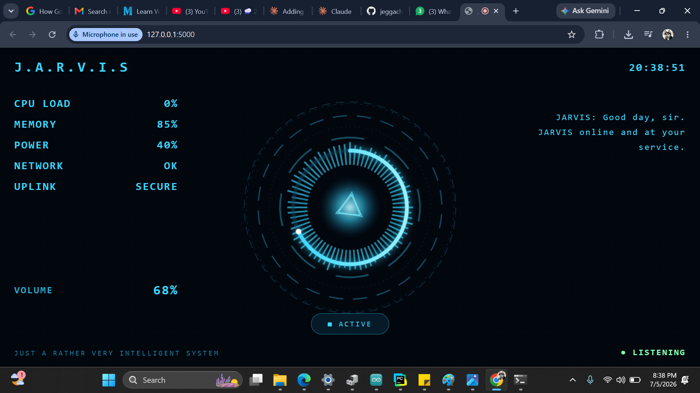

# J.A.R.V.I.S — Voice-Controlled AI Desktop Assistant

A voice-controlled AI assistant with a holographic Iron Man–style HUD. Speak to it
in the browser and it runs real actions on your Windows PC — opening apps, changing
the volume, taking screenshots, reporting system stats, sending WhatsApp messages,
setting reminders — and falls back to a local AI brain for open conversation.

The interface is a glowing arc-reactor HUD with rotating tech rings, live
audio-reactive bars that pulse to both your voice and JARVIS's reply, a wireframe
globe, and live CPU / memory / battery / volume readouts.



---

## Demo

   https://github.com/user-attachments/assets/f52edc67-d921-473c-9bd0-559fbb2b16fc
---

## How it works

JARVIS splits the job between the browser and Python, using each for what it does best:

- **Browser (front end)** — handles the microphone (speech-to-text) and the voice
  output (text-to-speech), so the HUD's audio bars react to real sound. It also
  renders the animated HUD.
- **Python / Flask (back end)** — receives the recognised text command, runs the
  matching *skill* on your actual laptop, and sends the spoken reply back to the page.
- **Local AI brain** — when no built-in skill matches, the command is passed to a
  local Ollama model (`llama3.2:1b`) that replies in a short, dry, JARVIS-style
  sentence. Everything runs on your own machine — no cloud, no API key.

```
  Your voice → Browser speech-to-text → Flask /command
        → skill match?  yes → run action on PC → reply text
                        no  → Ollama AI brain  → reply text
        → Browser speaks reply + audio bars animate
```

---

## Features / voice commands

| Say something like… | JARVIS does |
|---|---|
| "what's the time / date" | Reports current time or date |
| "battery / CPU / memory" | Reads live system stats via `psutil` |
| "what's the volume" | Reads the real Windows master volume |
| "volume up / down by 20" | Sets exact volume via `pycaw` |
| "mute" | Mutes the system |
| "take a screenshot" | Saves a screenshot to your Desktop |
| "search for …" | Opens a Google search |
| "play …" | Opens a YouTube search |
| "open chrome / notepad / …" | Launches an app |
| "message mom hello" | Opens WhatsApp Web with the message pre-typed |
| "call dad" | Opens a WhatsApp call to a saved contact |
| "remind me to … at 5 pm" | Sets a reminder that speaks when due |
| "lock the computer" | Locks Windows |
| anything else | Handled by the local AI brain |

---

## Tech stack

- **Python 3** + **Flask** — back-end server and skill router
- **Ollama** (`llama3.2:1b`) — local conversational AI brain
- **psutil** — CPU, memory, battery stats
- **pyautogui** — screenshots, media keys
- **pycaw** / **comtypes** — precise Windows volume control
- **pywhatkit** — WhatsApp messaging
- **HTML / CSS / JavaScript** — the animated HUD (browser speech APIs for mic + voice)

---

## Project structure

```
JARVIS/
├── app.py                 # Flask back end — the brain and skill router
├── templates/
│   └── index.html         # the HUD web page (Flask serves this)
├── static/                # any static assets used by the HUD
├── media/
│   └── JARVIS_DEMONSTRATION_FINAL.mp4
├── images/
│   └── hud_screenshot.png
├── requirements.txt
├── HOW_TO_RUN.txt
└── README.md
```

---

## Setup & run

1. Install the Python libraries:
   ```
   pip install -r requirements.txt
   ```
2. Install [Ollama](https://ollama.com) and pull the model:
   ```
   ollama pull llama3.2:1b
   ```
3. From inside the project folder, run:
   ```
   python app.py
   ```
   It prints `http://127.0.0.1:5000` and opens your browser.
4. Click **ENGAGE**, allow microphone access, and talk.

Full notes are in [`HOW_TO_RUN.txt`](HOW_TO_RUN.txt).

> **Note:** Volume control and app launching are built for **Windows**. The
> WhatsApp and "call" features need your own contact numbers filled into the
> `CONTACTS` dictionary in `app.py`.

---

## Roadmap

- Wire the audio bars to the live microphone amplitude
- Add a wake-word so JARVIS listens hands-free
- Swap in a larger local model for smarter conversation
- Custom skills: weather, calendar, smart-home control

---

## About

Built as a self-learning project in AI, voice interfaces, and desktop automation —
part of an ongoing journey into robotics and AI engineering.
